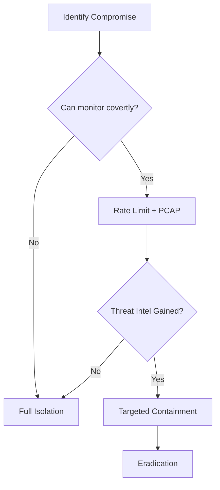

Task 2: Preservation of Evidence


Task 3: Alerting the Relevant Stakeholders


Task 4: Isolation of the Incident


Task 5: Business Continuity Plan


Task 6: Documentation of Actions


Task 7: Handing Over

### Essential Notes on Incident Response Evidence Preservation:

#### **Key Principles to Memorize:**
1. **Volatility Order (Critical Sequence):**
   - `1. Registers/Cache` → `2. Memory/Routing Tables` → `3. Temp Files` → `4. Disk` → `5. Remote Logs` → `6. Network Topology` → `7. Backups`
   - *Mnemonic*: **"Real Memory Temp Disks Log Networks Backups"**

2. **Three Absolute DON'Ts:**
   - 🚫 **Never power off** (destroys RAM evidence)
   - 🚫 **Never use system tools** (compromised binaries alter evidence)
   - 🚫 **Never modify file access times** (use write-blockers)

3. **Chain of Custody Essentials:**
   - Document every evidence transfer
   - Prove integrity via cryptographic hashes (SHA-256)
   - Only analyze COPIES, never originals

---

### Beyond the Text: Critical Insights & Pro Techniques

#### 1. **Evidence Collection Toolkit:**
   - **Memory Acquisition**: 
     - Tools: `FTK Imager`, `Belkasoft RAM Capturer`, `Magnet RAM Capture`
     - Always hash output: `sha256sum memory.dd`
   - **Disk Imaging**:
     - Use hardware write-blockers (Tableau/Talon)
     - Cloud systems: Snapshot volumes *before* isolation
   - **Volatile Data Scripts**:
     ```powershell
     # Windows: Capture process list, network connections
     pslist.exe > processes.txt; netstat -ano > connections.txt
     ```

#### 2. **Stealth Preservation Tactics:**
   - **Network Deception**: 
     - Redirect attacker traffic to honeypots using VLAN hopping
     - Leave host on network but mirror traffic to security appliance
   - **Memory Acquisition Evasion**:
     - Use DMA (Direct Memory Access) via FireWire/Thunderbolt
     - Cold boot attacks for encrypted RAM (specialized equipment)

#### 3. **Legal Landmines to Avoid:**
   - **Admissibility Failures**: 
     - Missing timestamp in custody log → evidence rejected
     - No proof of hashing algorithm strength
   - **Jurisdiction Issues**:
     - Cloud evidence across borders requires MLAT treaties
     - GDPR conflicts with evidence preservation

#### 4. **Advanced Threat Scenarios:**
   - **Anti-Forensic Malware**:
     - Poppy Nightmare (wipes registers on detection)
     - Slingshot (corrupts memory dumps)
   - **Cloud Evidence**:
     - API-based acquisition (AWS: `GetMemoryDump` EC2 API)
     - Immutable storage buckets for logs (AWS S3 Object Lock)

#### 5. **Real-World Workflow:**
   ```mermaid
   graph LR
   A[Identify Compromise] --> B{Is host critical?}
   B -->|Yes| C[RAM capture → Network redirect]
   B -->|No| D[Full disk image]
   C --> E[Live memory analysis]
   E --> F[Extract IOC → Hunt laterally]
   ```

---

### Pro Response Checklist:
1. **Immediate Actions:**
   - Deploy **network tap** (don't disconnect!)
   - Capture **RAM** via pre-authorized jump drive
   - Run **trusted binaries** from CD/USB: 
     - `WinPmem` (Windows), `LiME` (Linux)
2. **Documentation:**
   - Timestamped video of screen
   - Photograph physical connections
3. **Containment:**
   - Firewall quarantine (allow outbound to C2 for tracking)
   - Deploy canary tokens on adjacent systems

> 💡 **Golden Rule**: "The attacker's first move determines your first save." Prioritize evidence matching the initial compromise vector (e.g., RAM for fileless malware, disk for ransomware).

### Case Study: 
**Target Breach 2013 Failure**: 
- Turned off HVAC systems → destroyed RAM evidence of malware
- **Result**: 40M credit cards stolen; couldn't prove attack path  
- **Fix Needed**: Should've used PCIe-based memory acquisition cards


### Key Notes from Incident Response Playbooks:

#### Core Principles to Memorize:
1. **Playbook Purpose**:  
   - Predefined, repeatable steps to ensure no actions are forgotten during incidents.  
   - Integrated workflows (e.g., phishing playbook triggers account compromise playbook).

2. **Phishing Playbook Example Flow**:  
   ```mermaid
   graph TD
   A[Start] --> B[Suspect email received]
   B --> C[Evaluate email]
   C --> D{Contains URL/Attachment?}
   D -->|No| E[Notify user]
   E --> F[End]
   D -->|Yes| G[Compute file hash]
   G --> H[Send hash/URL to VirusTotal]
   H --> I{Malicious?}
   I -->|Yes| J[Delete emails]
   I -->|No| K[Notify user]
   ```

---

### Critical Enhancements Beyond the Text:

#### 1. **Playbook Design Best Practices**
   - **Automated Enrichment**:  
     Integrate APIs (VirusTotal, AbuseIPDB) for real-time IOC validation.  
     *Example*: Auto-quarantine emails if VT score > 80%.  
   - **Dynamic Branching**:  
     ```mermaid
     graph LR
     A{Attachment type?} -->|.exe/.dll| B[Isolate host]
     A -->|Macro-enabled| C[Disable macros]
     A -->|PDF/JS| D[Sandbox analysis]
     ```
   - **False Positive Mitigation**:  
     Cross-verify with EDR/NDR telemetry before containment.

#### 2. **Stakeholder Notification Framework**
   | Severity | Notify Within | Stakeholders |
   |----------|---------------|--------------|
   | Critical (e.g., ransomware) | 5 mins | CISO, Legal, PR |
   | High (e.g., data exfil) | 15 mins | IT Director, DPO |
   | Medium (e.g., phishing) | 1 hour | SOC Manager |
   | Low (e.g., false positive) | 24 hours | Team Lead |

#### 3. **Automation Scripting Snippets**
   ```python
   # Auto-contain phishing with Microsoft Graph API
   import msgraph
   def contain_phishing(email_id):
       msgraph.quarantine_email(email_id)
       msgraph.disable_user(email.sender)
       msgraph.hunt_similar_emails(ioc=email.subject)
   ```

#### 4. **Real-World Playbook Gaps & Fixes**
   - **Missing Step**: Credential harvesting checks  
     *Add*: `Check HaveIBeenPwned for exposed passwords`  
   - **Alert Fatigue Risk**:  
     *Add*: `Only escalate after 3+ internal reports`  
   - **Cloud Integration**:  
     *Add*: `Scan AWS S3 for similar malicious files`

#### 5. **Metrics for Playbook Effectiveness**
   | Metric | Target | Tool |
   |--------|--------|------|
   | Mean Time to Acknowledge (MTTA) | < 10 mins | PagerDuty |
   | False Positive Rate | < 15% | SIEM dashboards |
   | Containment Success | > 95% | Cortex XSOAR |

---

### Pro Tips for Implementation:
1. **Tabletop Testing**:  
   Run quarterly simulations with purple teams using:  
   ```bash
   # Simulate phishing campaign
   go-phish -template payroll_phish.json
   ```
2. **SOAR Integration**:  
   Automate playbooks with:  
   - TheHive + Cortex for open-source  
   - Swimlane/Splunk SOAR for enterprise  
3. **Chain of Custody Automation**:  
   Use blockchain logging (e.g., IBM Blockchain Transparent Supply) for court-admissible evidence tracking.

> 💡 **Critical Insight**: Playbooks fail without **pre-defined severity matrices** and **automated context enrichment**. Always include:  
> - Impact scoring (e.g., FIN7 vs script kiddie)  
> - Business criticality mapping (e.g., SAP server vs test VM)


### Essential Notes on Incident Containment:

#### Core Principles to Memorize:
1. **Containment Sequence** (Critical Order):  
   **Containment → Eradication → Recovery**  
   *(NIST Incident Management Framework)*  
   - *Never* skip containment - doing so wastes eradication efforts

2. **Isolation Methods**:  
   - **Network Segmentation**: VLAN isolation (e.g., move to quarantine VLAN)  
   - **Physical Isolation**: Confiscate device/disconnect cables  
   - **Virtual Isolation**: EDR "jailing" (allow-listed comms only)  

3. **Stealth Alternative**:  
   **Rate Limiting** (slowing internet to 56k dial-up speeds):  
   - Prevents attacker suspicion  
   - Allows C2 monitoring while hindering data exfiltration  

---

### Beyond the Text: Advanced Containment Tactics

#### 1. Cloud & Hybrid Environment Tactics
   | Environment | Technique | Tool Example |
   |-------------|-----------|--------------|
   | **AWS/Azure** | Security Group Isolation | `aws ec2 revoke-security-group-egress` |
   | **Kubernetes** | NetworkPolicy quarantine | `kubectl label pod compromised=true` |
   | **Hybrid** | SDN microsegmentation | VMware NSX, Cisco ACI |

#### 2. Covert Containment Strategies
   - **TCP Sinkholing**:  
     Redirect malicious traffic to honeypots using BGP hijacking  
   - **DNS Poisoning**:  
     Respond to C2 DNS queries with false IPs (e.g., `127.0.0.1`)  
   - **Credential Vaulting**:  
     Rotate AD/Kerberos tickets while preserving attacker sessions  

#### 3. Rate Limiting Implementation
   ```bash
   # Linux: Limit compromised host to 56kbps
   tc qdisc add dev eth0 root tbf rate 56kbit latency 50ms burst 1540
   ```
   - **Monitoring Advantage**:  
     Allows full packet capture (PCAP) of slowed C2 traffic  
   - **Detection Threshold**:  
     Trigger at >500KB/s outbound (typical ransomware threshold)  

#### 4. EDR Jail Techniques
   | Action | Command Example (Carbon Black) |
   |--------|--------------------------------|
   | Process Blocking | `cb process-block -n mimikatz.exe` |  
   | Network Quarantine | `cb network-quarantine -i 192.0.2.5` |  
   | File Lockdown | `cb file-lock -p /tmp/malware.dll` |  

#### 5. Failure Scenarios & Fixes
   - **Compromised EDR**:  
     → Use out-of-band network controls (firewall API calls)  
   - **Cloud Credential Theft**:  
     → Rotate keys *without* revoking current sessions  
   - **OT Systems**:  
     → Deploy "air gap" bridges with data diodes  

---

### Pro Containment Workflow


> ⚠️ **Critical Tradeoff**:  
> - **Aggressive Containment**: Risk alerting attackers (e.g., FIN7 counter-wipe)  
> - **Covert Containment**: Risk data exfiltration during monitoring  

---

### Real-World Implementation Checklist
1. **Pre-Configure Controls**:  
   - Quarantine VLANs  
   - EDR jail profiles  
   - Rate limiting rulesets  
2. **Verify Isolation**:  
   ```powershell
   # Confirm no network access after containment
   Test-NetConnection -ComputerName 8.8.8.8 -Port 53
   ```
3. **Legal Safeguards**:  
   - Document containment time/actions  
   - Preserve original firewall rules as evidence  

**Case Study**: Maersk 2017  
- **Mistake**: Aggressive containment triggered NotPetyra counter-wipe  
- **Solution Needed**: Gradual rate limiting + decoy file servers


### Essential Notes on Business Continuity Planning (BCP):

#### Core Principles to Memorize:
1. **BCP Trigger**:  
   Invoked *after* containment for **high-severity incidents** only  
   - Grants "superpowers" to bypass normal change controls  
   - Requires senior management authorization  

2. **BCP vs DRP**:  
   - **BCP**: Holistic recovery (comms, stakeholders, processes)  
   - **DRP**: Technical infrastructure restoration *(subset of BCP)*  

3. **BCP Creation Steps**:  
   ```mermaid
   graph LR
   A[BIA] --> B[Recovery Actions] --> C[Team Structure] --> D[Testing]
   ```

4. **Critical Metrics**:  
   | Metric | Definition | Key Relationship |
   |--------|------------|------------------|
   | **RPO** | Max acceptable data loss | Dictates backup frequency |
   | **RTO** | Hardware recovery time |  |
   | **WRT** | Software/data recovery time | **RTO + WRT ≤ MTD** |
   | **MTD** | Max tolerable downtime | Business survival threshold |

---

### Beyond the Text: Advanced BCP Insights

#### 1. Cloud-Native BCP Tactics
   | Provider | BCP Feature | Use Case |
   |----------|-------------|----------|
   | **AWS** | Pilot Light DR | Minimal DR environment (RPO mins) |
   | **Azure** | Site Recovery | Automated failover (RTO < 15min) |
   | **GCP** | Persistent Disk Snapshots | Near-zero RPO with multi-region sync |

#### 2. Metric Optimization Techniques
   - **Achieve Near-Zero RPO**:  
     Use synchronous replication (e.g., VMware vSAN, NetApp MetroCluster)  
   - **Slash RTO**:  
     Pre-stage IaC templates (Terraform/CloudFormation) for 1-click DR  
   - **MTD Negotiation**:  
     Run failure simulations with finance to set business-backed MTD  

#### 3. Modern BCP Testing Methods
   ```bash
   # Chaos Engineering: Simulate region failure
   chaos toolkit run aws-region-blackout.json
   ```
   - **Red Team BCP Tests**: Attack DR systems during exercises  
   - **Tabletop++**: Inject real-time disruptions (e.g., cut network during drill)  

#### 4. BCP Automation Framework
   ```python
   # Auto-invoke BCP when SIEM detects critical incident
   def invoke_bcp(incident):
       if incident.severity > 9: 
           activate_dr_site()
           notify_c_levels()
           override_change_controls()  # BCP superpower
   ```

#### 5. Industry-Specific Requirements
   | Sector | Regulation | BCP Mandate |
   |--------|------------|-------------|
   | **Finance** | FINRA 4370 | 2hr MTD for trading systems |
   | **Healthcare** | HIPAA | 4hr RTO for patient data |
   | **Energy** | NERC CIP | 15min RPO for grid controls |

---

### Pro Implementation Checklist
1. **BIA Deep Dive**:  
   - Map process dependencies (e.g., CRM → billing → shipping)  
   - Quantify hourly downtime costs (e.g., $500K/hr for e-commerce)  
2. **Team Structure Best Practices**:  
   ```mermaid
   graph TB
   A[BCP Commander] --> B[Tech Recovery]
   A --> C[Comms Lead]
   A --> D[Legal Liaison]
   ```
3. **Documentation Safeguards**:  
   - Blockchain-log all BCP decisions (e.g., OpenTimestamps)  
   - Store physical BCP copies in faraday bags  

> ⚠️ **Critical Failure Point**:  
> 73% of BCPs fail due to **outdated contact lists** (Gartner). Verify quarterly!

---

### Real-World BCP Timeline

```mermaid
gantt
    title BCP Activation (Ransomware Scenario)
    dateFormat  X
    axisFormat %s
    section Containment
    Network isolation : 0, 5
    section BCP Invocation
    CEO approval : 5, 10
    DR site activation : 10, 15
    section Recovery
    Data restore (RTO) : 15, 45
    App validation (WRT) : 45, 75
```


**Case Study**: British Airways 2017  
- **Mistake**: Failed BCP test → real outage cost £58M  
- **Fix**: Automated cloud failover + chaos engineering


### Critical Documentation Principles for Incident Response:

#### Must-Memorize Elements:
1. **BCP Documentation Requirements**:  
   - Every action taken *must* be recorded despite bypassing normal change controls  
   - Failure to document = inability to reconstruct incident timeline

2. **Documentation Template Fields**:  
   ```markdown
   1. Timestamp (UTC) of request  
   2. Action performed  
   3. Justification  
   4. Approver  
   5. Implementer  
   6. Completion time  
   7. Observed outcomes
   ```

3. **Accountability Mechanism**:  
   - Explicit assignment of responsibility prevents "assumed action" gaps  
   - UTC timestamps enable cross-system correlation

---

### Beyond the Text: Advanced Documentation Tactics

#### 1. Automation Integrations
   | Tool | Automation | Benefit |
   |------|------------|---------|
   | **Splunk** | `| sendalert` action logging | Auto-captures SIEM response actions |
   | **Jira** | BCP workflow triggers | Creates audit trail for approvals |
   | **Git** | Infrastructure-as-Code commits | Documents system changes with hashes |

#### 2. Forensic-Grade Documentation
   ```bash
   # Generate cryptographic proof of documentation
   gpg --clearsign incident_log.md
   git commit -S -m "BCP Action #1434"
   ```
   - **Blockchain Anchoring**: Use OpenTimestamps for immutable proof
   - **WORM Storage**: Write-Once-Read-Many media for legal defensibility

#### 3. Real-Time Collaboration Framework
   ```mermaid
   graph LR
   A[Slack Command] --> B(BCP Bot)
   B --> C[Google Docs Template]
   C --> D[Blockchain Timestamp]
   D --> E[Encrypted S3 Bucket]
   ```

#### 4. Lessons Learned Process
   **Post-Incident Review Checklist**:
   1. Reconstruct timeline from documentation
   2. Identify decision latency points
   3. Measure MTTR (Mean Time to Resolution)
   4. Update playbooks with failure insights
   5. Conduct red team validation of fixes

#### 5. Regulatory Documentation Requirements
   | Regulation | Documentation Standard | Penalty Example |
   |------------|-------------------------|-----------------|
   | **GDPR** | 72hr breach reporting | €20M or 4% global revenue |
   | **HIPAA** | 6-year audit trail retention | $1.5M per violation |
   | **SOX** | Change management logs | Executive imprisonment |

---

### Pro Documentation Workflow
1. **Pre-Incident Prep**:
   - Store encrypted templates in lastpass/1password
   - Pre-authorize blockchain notary keys
2. **During Incident**:
   ```python
   # Auto-log EDR containment actions
   def log_action(action):
       utc_time = datetime.utcnow().isoformat()
       with open("bcp_log.md", "a") as f:
           f.write(f"| {utc_time} | {action} | ... |\n")
       os.system("openssl dgst -sha256 bcp_log.md >> log_proof.txt")
   ```
3. **Post-Incident**:
   - Generate Merkle tree of all evidence
   - Store in AWS Glacier Vault Lock

> ⚠️ **Failure Case**: Uber 2016 breach coverup  
> - Destroyed documentation → $148M fine  
> - **Fix**: Mandatory cryptographically-sealed logs

---

### Documentation Quality Assessment
Rate your logs against this scale:
1. **Level 0**: Handwritten notes
2. **Level 1**: Timestamped digital notes
3. **Level 2**: Automated action logging
4. **Level 3**: Blockchain-verified with hash chains
5. **Level 4**: Integrated with SOAR/EDR APIs

**Target**: Level 3+ for court-admissible evidence
