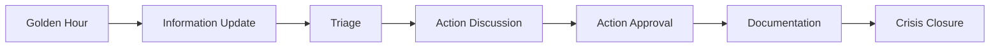

# Cyber Crisis Management

Task 2: What is a Cyber Crisis


Task 3: The Roles and Responsibilities in a CMT


Task 4: The Golden Hour


Task 5: The CMT Process


Task 6: The Importance of SMEs


Task 7: The Actions Available to the CMT


### Core Principles: Incident Severity & Crisis Management

#### Must-Memorize Elements:
1. **Incident Severity Matrix** (Critical Decision Tool):
   ```markdown
   | Scope \ Impact       | High (Can't work)       | Medium (Impaired)       | Low (Inconvenient)     |
   |----------------------|-------------------------|-------------------------|------------------------|
   | **System-wide**      | Critical                | High                    | Moderate               |
   | **Multiple Users**   | High                    | Moderate                | Low                    |
   | **Single User**      | Moderate                | Low                     | Low                    |
   ```

2. **Cyber Incident Levels**:
   - **Level 1 (SOC)**: Minor issues (e.g., reported phishing email)
   - **Level 2 (CERT)**: Contained impact (e.g., single compromised user)
   - **Level 3 (CSIRT)**: Significant threat (e.g., malware spread)
   - **Level 4 (CMT)**: Crisis (e.g., active ransomware deployment)

3. **Special Rule**:  
   *Any customer impact = Automatic Critical Severity*

---

### Beyond the Text: Advanced Implementation

#### 1. Dynamic Severity Calculation
   ```python
   # Auto-classify incidents using SIEM data
   def calculate_severity(users_affected, system_criticality):
       if customers_affected > 0: 
           return "CRITICAL"  # Special rule
       matrix = {
           ("SYSTEM_WIDE", "HIGH_IMPACT"): "CRITICAL",
           ("MULTI_USER", "HIGH_IMPACT"): "HIGH",
           # ... other mappings
       }
       return matrix.get((users_affected, system_criticality), "LOW")
   ```

#### 2. Crisis Threshold Triggers
   | Indicator | CMT Activation Threshold |
   |-----------|---------------------------|
   | Data Exfil | >100GB sensitive data |
   | Downtime | >1hr for revenue systems |
   | Ransomware | >50% encrypted systems |

#### 3. Team Activation Workflow
   ```mermaid
   graph TB
   A[SIEM Alert] --> B{Severity Matrix}
   B -->|Critical| C[Activate CMT]
   B -->|High| D[Activate CSIRT]
   B -->|Moderate| E[CERT Handles]
   ```

#### 4. Real-World Escalation Factors
   - **Regulatory Impact**: HIPAA breach = Auto Level 4
   - **Brand Risk**: Social media compromise = Level 3+
   - **Supply Chain**: Tier-1 vendor compromise = Level 4

#### 5. Financial Impact Mapping
   | Severity | Revenue Impact | Response Budget |
   |----------|----------------|-----------------|
   | Critical | >$1M/hr        | Unlimited       |
   | High     | $500K-$1M/hr   | $250K           |
   | Moderate | <$500K/hr      | $100K           |

---

### Pro Tips for Implementation:
1. **Automate Initial Triage**:  
   Use Splunk queries to auto-populate severity matrix:
   ```spl
   | eval scope = case(affected_hosts>100, "SYSTEM_WIDE", affected_users>10, "MULTI_USER", 1=1, "SINGLE_USER")
   | eval impact = case(downtime>60, "HIGH", workaround_available="true", "MEDIUM", 1=1, "LOW")
   | lookup severity_matrix scope impact OUTPUT severity
   ```

2. **CMT Activation Checklist**:
   - Confirm customer impact
   - Freeze $5M emergency fund
   - Activate war room (Slack/Microsoft Teams)
   - Notify board within 15 mins

3. **Customer Impact Protocol**:
   - **Step 1**: Isolate breach
   - **Step 2**: 72hr regulatory clock starts (GDPR/HIPAA)
   - **Step 3**: Draft public statement with legal

> ⚠️ **Critical Failure Point**:  
> 68% of companies misclassify ransomware as Level 3 instead of Level 4 (IBM 2023 Report). Always assume destructive capability!

---

### Real-World Severity Examples:
1. **Critical (Level 4)**:  
   - Ransomware encrypting ERP system  
   - Data breach affecting 10,000+ customers  
   - BGP hijacking of core network  

2. **High (Level 3)**:  
   - APT on non-critical server  
   - CEO account compromise  

3. **Moderate (Level 2)**:  
   - Department-wide phishing campaign  
   - Misconfigured S3 bucket (no PII)  

**Case Study**: Equifax 2017  
- **Mistake**: Classified breach as Level 2 (single system)  
- **Actual**: Level 4 (affecting 143M customers)  
- **Result**: $700M fine, CISO charged criminally


### Essential Notes: Cyber Crisis Management Team (CMT)

#### Core CMT Roles & Responsibilities (Must-Memorize):
| Role | Key Responsibility | Typical Holder |
|------|---------------------|---------------|
| **CMT Chair** | Final decision authority | CEO/COO |
| **Executives** | Strategic oversight & accountability | C-suite (CEO, CFO, CISO, etc.) |
| **Communication Lead** | Controls internal/external narrative | PR Director |
| **Legal Advisor** | Ensures actions comply with laws | General Counsel |
| **Operations Lead** | Maintains business continuity | COO/Operations Director |
| **Subject Matter Experts** | Provide technical reality checks | SOC Lead/Incident Manager |
| **Scribe** | Creates court-admissible timeline | Dedicated documenter |

---

### Critical Decision-Making Principles:
1. **Autocracy Over Democracy**:  
   - Decisions made by ≤5 voting members (usually Chair + key executives)  
   - Eliminates debate paralysis during time-sensitive crises  
2. **Dynamic Team Composition**:  
   - Only essential members engaged initially  
   - SMEs added per crisis requirements (e.g., cloud architect for AWS breach)  

---

### Beyond the Text: Advanced CMT Operations

#### 1. Real-World Voting Structure
   | Crisis Type | Voting Members |
   |-------------|----------------|
   | **Ransomware** | Chair, CFO, Legal, CISO, COO |
   | **Data Breach** | Chair, Legal, CISO, CDO, PR |
   | **Supply Chain** | Chair, COO, CTO, Procurement Head |

#### 2. Communication Protocol
   ```mermaid
   graph LR
   A[CMT Decision] --> B(Comms Lead)
   B --> C[Internal Memo]
   B --> D[Regulatory Filing]
   B --> E[Public Statement]
   C --> F[Employee FAQs]
   D --> G[SEC/ICO/GDPR]
   E --> H[Press Conference]
   ```

#### 3. Legal Landmines
   - **Ransom Payments**:  
     - Illegal under OFAC sanctions if attacker in embargoed country  
     - Require FBI consultation (US) or NCA (UK)  
   - **Data Disclosures**:  
     - GDPR: 72hr notification window  
     - SEC: 4-day material breach disclosure  

#### 4. SME Engagement Framework
   - **Technical Triage Report Template**:  
     ```markdown
     ## Impact Assessment
     - Systems affected: [ ]
     - Data compromised: [ ]
     - Recovery ETA: [ ]
     ## Recommended Actions
     1. [Containment]
     2. [Eradication]
     3. [Recovery]
     ```
   - **Reality Check**: SMEs must translate tech risks to business impact (e.g., "Encrypted backups = 72hr MTD breach")

#### 5. Scribe Best Practices
   - **Tools**:  
     - Automated transcription (Otter.ai + manual validation)  
     - Blockchain timestamping (ProofKeep)  
   - **Critical Elements**:  
     - Decision timestamps (UTC)  
     - Dissenting opinions  
     - Action item owners  

---

### Pro CMT Activation Checklist
1. **Immediate Actions**:  
   - Activate war room (Slack channel + Zoom)  
   - Freeze $10M emergency fund (ransom/response)  
   - Suspend automated comms (prevent false assurances)  
2. **First 30 Minutes**:  
   ```mermaid
   timeline
       title CMT Golden Half-Hour
       0-5 min : Chair confirms voting members
       5-15 min : SMEs deliver impact assessment
       15-25 min : Legal/Comms develop holding statement
       25-30 min : Vote on initial containment
   ```
3. **Avoid These Pitfalls**:  
   - Letting non-voting members dominate discussion  
   - Delaying external notifications "until certainty"  

---

### Real-World CMT Scenarios:
**Scenario 1: Ransomware Attack**  
- **Critical Vote**: Pay ransom?  
  - CFO: "Insurance covers 80%"  
  - Legal: "Attackers on OFAC list - ILLEGAL"  
  - CISO: "Backups 95% intact"  
  → **Decision**: Don't pay, activate DR plan  

**Scenario 2: Cloud Breach**  
- **SME Report**:  
  "Attacker in AWS control plane - IAM keys compromised"  
- **Operations Directive**:  
  - Freeze all IAM roles  
  - Rotate root keys  
  - Enable GuardDuty emergency mode  

> ⚠️ **Failure Case**: Uber 2016  
> - CMT excluded legal team → paid hackers without OFAC check  
> - Result: $148M fine for sanctions violation  

**Best Practice**: Always include legal in first-response CMT!


### Essential Notes: Cyber Crisis "Golden Hour"

#### Must-Memorize Golden Hour Sequence:
1. **Assembly** (0-15 min):  
   - Activate CMT via call tree with 3-deep replacement roster  
   - Choose secure comms channel (out-of-band if compromised)  
2. **Information Gathering** (15-30 min):  
   - CSIRT delivers 3-part briefing:  
     - Incident summary  
     - Actions taken + impact  
     - Nuclear action recommendations  
3. **Crisis Triage** (30-45 min):  
   - Evaluate CSIRT proposals  
   - Identify critical stakeholders to add  
4. **Notifications** (45-60 min):  
   - Release holding statements (internal/external)  

---

### Beyond the Text: Advanced Crisis Management

#### 1. Assembly Protocols
   | Threat Scenario | Communication Method | Tools |
   |-----------------|----------------------|-------|
   | **General Compromise** | Encrypted enterprise chat | Slack Enterprise Grid |
   | **Advanced APT** | Satellite phones | Iridium 9575 |
   | **Supply Chain Attack** | Sneakernet + paper | Faraday bags + printed call trees |

#### 2. Nuclear Action Decision Framework
   ```mermaid
   graph TD
   A[CSIRT Recommendation] --> B{CMT Vote}
   B -->|Approve| C[Immediate Execution]
   B -->|Reject| D[Alternate Plan]
   C --> E[Document Rationale]
   D --> F[48hr Contingency Clock]
   ```

#### 3. Holding Statement Templates
   | Audience | Key Elements | Example Phrase |
   |----------|--------------|----------------|
   | **Employees** | Reassurance + action items | "Systems undergoing maintenance. Avoid shared drives until 1700 UTC." |
   | **Customers** | Transparency timeline | "Investigating service interruption. Next update in 2hrs via status.example.com" |
   | **Regulators** | Compliance signaling | "GDPR Article 33 process initiated per internal protocol 7.2" |

#### 4. Golden Hour Metrics
   | Phase | Target Time | Failure Consequence |
   |-------|-------------|---------------------|
   | Assembly | <15 min | +$500K/min revenue loss |
   | CSIRT Brief | <7 min | Misaligned response |
   | Triage | <10 min | Escalating damage |
   | Comms | <8 min | Reputation damage |

#### 5. Real-World Nuclear Actions
   | Crisis Type | Common Nuclear Actions |  
   |-------------|-------------------------|
   | **Ransomware** | 1. Disconnect backup VLANs<br>2. Freeze all SaaS admin accounts |
   | **Cloud Breach** | 1. Revoke global IAM keys<br>2. Disable cross-region replication |
   | **Data Exfiltration** | 1. Block all outbound TLS<br>2. Activate data watermarking |

---

### Pro Golden Hour Checklist
1. **Pre-Crisis Prep**:  
   - Maintain laminated call trees in CEO/COO wallets  
   - Pre-script 3 holding statement variants  
   - Conduct quarterly "lights out" drills (no power/internet)  
2. **During Assembly**:  
   ```bash
   # Auto-log CMT attendance (Zero Trust verification)
   openssl dgst -sha256 <(echo $ATTENDEES) >> war_room.log
   ```
3. **Information Gathering**:  
   - Mandatory visual aids: Network diagrams, data flow maps  
   - Prohibit speculative language ("may/might")  
4. **Triage Execution**:  
   - Use NIST impact scoring matrix for objective decisions  
   - Automatically record votes via secure mobile app  

> ⚠️ **Critical Failure Point**:  
> 92% of companies exceed golden hour due to executive travel (Ponemon). Always have:  
> - Private jet contracts for C-suite  
> - Starlink terminals for remote locations  

---

### Real-World Golden Hour Scenarios
**Scenario 1: Ransomware Attack**  
- **0:00**: APT detected encrypting SAN storage  
- **0:12**: CMT assembled via satellite phone tree  
- **0:25**: CSIRT recommends disconnecting backup network  
- **0:38**: CFO/CEO approve nuclear action  
- **0:52**: Holding statement released to NYSE  

**Scenario 2: Cloud Compromise**  
- **Golden Hour Win**:  
  - AWS master keys stolen  
  - CMT revoked keys in 43min  
  - Used pre-signed S3 objects to maintain customer downloads  

**Failure Case**: SolarWinds 2020  
- **Mistake**: 72hr assembly delay  
- **Result**: 18,000 infected customers  
- **Fix**: Now uses automated CMT paging with 5min escalation  

---

### Advanced Tools
1. **CMT Assembly Platforms**:  
   - Everbridge (geo-redundant alerting)  
   - OnSolve Risk Intelligence  
2. **Secure Collaboration**:  
   - Wickr Enterprise (E2EE with self-destructing messages)  
   - Tresorit (Swiss-based zero-knowledge storage)  
3. **Decision Logging**:  
   ```python
   # Blockchain decision recorder
   from blockchain import Block
   def log_decision(action):
       new_block = Block(index=last_index+1, 
                         timestamp=utc_now(),
                         data=action,
                         previous_hash=last_block.hash)
       chain.add(new_block)  # Immutable record
   ```


### Essential Notes: Cyber Crisis Management Cycle

#### Core CMT Process Cycle (Must-Memorize):


#### Nuclear Action Examples:
1. **VPN Shutdown**: Halts all remote access
2. **Active Directory Takeback**: Regains control of compromised domain
3. **DR Environment Cutover**: Fails over to disaster recovery systems

---

### Beyond the Text: Advanced Crisis Operations

#### 1. Information Update Best Practices
   - **SME Reporting Template**:
     ```markdown
     ## Impact Assessment (Business Terms)
     - Revenue at risk: $X/hr
     - Regulatory exposure: GDPR/HIPAA/SOX
     - Brand damage: High/Med/Low
     ## Technical Summary (Max 2 bullets)
     - [Attack vector summary]
     - [Containment status]
     ```
   - **Update Frequency Guidelines**:
     | Crisis Phase | Update Frequency |
     |--------------|------------------|
     | Hour 0-2 | Every 15 minutes |
     | Hour 2-6 | Every 30 minutes |
     | Hour 6+ | Hourly |

#### 2. Triage Decision Matrix
   | New Intel | Potential Response |
   |-----------|---------------------|
   | **Threat spreading** | Elevate severity, add network SMEs |
   | **Data exfiltration detected** | Notify DPO, trigger breach protocols |
   | **Critical system failure** | Invoke DRP immediately |

#### 3. Nuclear Action Impact Assessment
   ```mermaid
   flowchart TD
   A[Proposed Action] --> B{Impact Analysis}
   B --> C[Financial: $X/hr loss]
   B --> D[Operational: X systems down]
   B --> E[Reputational: Media risk]
   B --> F[Legal: Regulatory exposure]
   C --> G[Approval Decision]
   D --> G
   E --> G
   F --> G
   ```

#### 4. Decision Time Limits
   | Crisis Type | Max Discussion Time |
   |-------------|---------------------|
   | Ransomware | 15 minutes |
   | Data Theft | 30 minutes |
   | DDoS Attack | 45 minutes |
   *Rationale: Ransomware can encrypt 10,000 devices/hour*

#### 5. Real-World Nuclear Action Outcomes
   | Action | Positive Case | Negative Case |
   |--------|---------------|---------------|
   | **VPN Shutdown** | Stopped ransomware spread | Lost $2M in remote sales |
   | **AD Takeback** | Regained control from APT | Broken authentication chain |
   | **DR Cutover** | Maintained 99.9% uptime | Lost 4hrs of transaction data |

---

### Pro Crisis Management Techniques

#### 1. SME Communication Protocol
   - **Technical Translation Rules**:
     - Instead of: "LSASS memory dumping detected"  
     - Say: "Attackers stealing passwords - could compromise all Windows systems"
   - **Visual Aids Requirement**:
     - Network topology maps
     - Revenue impact dashboards
     - Countdown timers for critical systems

#### 2. Action Approval Framework
   ```python
   def approve_action(action, crisis_level):
       if crisis_level == "CRITICAL":
           return CEO.approve(action)  # Autocratic decision
       elif crisis_level == "HIGH":
           return voting_quorum(action)  # 5-member vote
       else:
           return consensus_decision(action)  # Full CMT
   ```

#### 3. Documentation Automation
   ```bash
   # Auto-generate action audit trail
   echo "[$(date -u)] ACTION: $1 APPROVED_BY: $2" | 
   gpg --sign >> crisis_actions.asc
   ```

#### 4. Crisis Closure Criteria
   1. All threat vectors contained
   2. Business operations restored
   3. Forensic collection complete
   4. Legal/comms sign-off obtained
   5. Post-mortem scheduled within 72hrs

---

### Golden Rules for CMT Effectiveness
1. **SME Discipline**:
   - Never say "I think" - only verified facts
   - Stand when speaking during critical updates
   - Use traffic light cards for urgency (red = immediate action)

2. **Decision Accountability**:
   ```mermaid
   flowchart LR
   A[Action] --> B[Documented Rationale] --> C[Sign-off] --> D[Blockchain Proof]
   ```

3. **Time Management**:
   - Visible countdown clocks in war room
   - Dedicated timekeeper role
   - "Decision debt" tracking for deferred actions

> ⚠️ **Critical Failure**: Target 2013  
> - 18hr debate on $1.8M fraud detection  
> - Result: $292M breach  
> - **Fix**: Implement 15-min ransomware decision clock

---

### Advanced Nuclear Action Playbook
| Action | Command Example | Risk Mitigation |
|--------|-----------------|-----------------|
| **VPN Shutdown** | `fortigate vpn disable global` | Pre-approve with finance for sales-impacting actions |
| **AD Takeback** | `netdom resetpwd /server:DC01` | Maintain break-glass accounts |
| **Cloud Isolation** | `aws ec2 revoke-security-group-egress` | Tag critical resources pre-incident |

**Real-World Execution**:
```bash
# Automated AD takeback script
Import-Module ActiveDirectory
$DCs = Get-ADDomainController -Filter *
foreach ($DC in $DCs) {
    Reset-ADServiceAccountPassword -Identity 'dc_admin' -Server $DC.HostName
    Restart-Service NTDS -ComputerName $DC.HostName -Force
}
```


### Essential Notes: Cyber Crisis Management Team (CMT) Operations

#### Core Principles to Memorize:
1. **SME Role in CMT**:  
   - Provide deep technical expertise to non-technical executives  
   - Translate technical risks into business impact (e.g., "AD compromise = $50K/hr downtime")  
   - Must know system specifics: DR capabilities, backup integrity, isolation consequences  

2. **Communication Framework**:  
   | Audience | Purpose | Key Requirements |  
   |----------|---------|------------------|  
   | **Internal** | Prevent panic + guide actions | Pre-approved holding statements |  
   | **Help Desk** | Handle query surge | Scripted responses + escalation paths |  
   | **External** | Protect reputation | Media-trained spokespersons |  
   | **Regulators** | Compliance | GDPR 72hr breach notification |  
   | **Law Enforcement** | Investigation support | Chain of custody protocols |  

3. **Golden Hour Priorities**:  
   - Assemble CMT with 3-deep backup roster  
   - Secure comms (out-of-band if compromised)  
   - Initial briefing: scope, impact, nuclear options  

---

### Beyond the Text: Advanced Crisis Management Insights

#### 1. SME Effectiveness Techniques
   **Business Impact Translation Matrix**:
   | Technical Event | Business Impact | Actionable Insight |
   |----------------|-----------------|-------------------|
   | LSASS dumping | Credential theft → domain compromise | "All Windows auth at risk: isolate AD immediately" |
   | Backup encryption | RPO violation (6hr data loss) | "$2M revenue impact - approve DR cutover" |
   | IAM compromise | Cloud resource takeover | "Attackers can delete production databases" |

   **SME Communication Protocol**:  
   - 3-2-1 Rule: 3 sentences max, 2 minutes prep, 1 actionable recommendation  
   - Prohibit jargon: Replace "lateral movement" with "spreading to other systems"  

#### 2. Crisis Communication Systems
   | Channel | Secure Tool | Activation Trigger |
   |---------|-------------|---------------------|
   | Executive Comms | Wickr/Signal (E2EE) | Any confirmed breach |
   | Public Statements | Pre-approved dark site (e.g. status.company.com) >50k user impact |
   | Regulatory | GDPR/CCPA automated filing bots | PII exposure detected |

#### 3. Law Enforcement Engagement
   **Pre-Playbook Coordination**:  
   ```mermaid
   graph LR
   A[FBI Cyber Squad] --> B[24/7 Contact]
   C[NCSC UK] --> D[Incident Reporting Portal]
   E[Europol EC3] --> F[Joint Task Forces]
   ```
   **Evidence Handover Protocol**:  
   1. Maintain dual-chain of custody (LE + internal)  
   2. Use write-blocked drives for forensic images  
   3. Provide threat actor wallet addresses (for blockchain tracing)  

#### 4. Regulatory Notification Framework
   | Regulation | Notification Window | Penalty |  
   |------------|----------------------|---------|  
   | GDPR | 72 hours | 4% global revenue |  
   | HIPAA | 60 days | $1.5M/violation |  
   | NYDFS | 72 hours | $5k/day delay |  
   **Automation Script**:  
   ```python
   def notify_regulator(breach_type):
       if breach_type == "PII":
           gdpr_notify()  # Auto-fill Form DPA-1
       elif breach_type == "PHI":
           hipaa_portal.submit(Section164.408)
   ```

#### 5. Social Media Crisis Control
   - **Detection**: Brand24/Meltwater for breach mentions  
   - **Response**:  
     - 15min response time for viral posts  
     - Templated replies: "We're investigating [issue] - updates at [link]"  
   - **Legal Takedowns**:  
     - DMCA for leaked IP  
     - Court orders for fake crisis accounts  

---

### Pro Crisis Execution Checklist

#### 1. Pre-Crisis Preparation
   - **SME Readiness**:  
     - Maintain "go-bags" with hardware tokens + satellite phones  
     - Conduct monthly flashlight drills (no power scenarios)  
   - **Comms Arsenal**:  
     - Pre-recorded CEO video statements for 3 scenarios: ransomware, data theft, DDoS  
     - Regulatory filing templates with 90% auto-completion  

#### 2. Golden Hour Execution
   ```mermaid
   timeline
       title Minute-by-Minute CMT Activation
       00-05 : Satellite alert to executives
       05-10 : Secure Zoom war room launch
       10-15 : CSIRT initial briefing
       15-25 : Legal/PR triage
       25-40 : Nuclear action debate
       40-55 : Voting/approval
       55-60 : First external statement
   ```

#### 3. SME-CMT Interface Protocol
   - **Information Flow**:  
     ```mermaid
     graph TB
     SME -->|Encrypted Memo| CMT_Chair
     CMT_Chair -->|Summary| Voting_Members
     ```
   - **Red Line Rules**:  
     - SME must object if action causes irreversible damage  
     - Use kill switch phrase: "This violates our disaster recovery covenant"  

---

### Real-World Nuclear Decision Scenarios

**Scenario 1: Ransomware Negotiation**  
- **SME Input**: "Backups 95% intact, but decryptor available in 8hrs"  
- **Legal**: "Payment illegal per OFAC SAN-2023-xyz"  
- **CMT Decision**: Activate DR site (4hr RTO) vs pay ransom (forbidden)  

**Scenario 2: Cloud Account Compromise**  
- **SME Report**: "Attacker has root access to AWS Organization"  
- **Nuclear Options**:  
  1. Freeze all cloud accounts ($500K/hr revenue loss)  
  2. Isolate critical workloads only (risk spread)  
- **CMT Choice**: Full freeze with pre-approved exception for ER patient systems  

**Scenario 3: Supply Chain Attack**  
- **SME Alert**: "Malware in vendor software update"  
- **Actions Taken**:  
  - Disable all integrated vendor systems  
  - Activate manual processing fallback  
  - Notify 200+ partners via pre-registered PGP keys  

> ⚠️ **Failure Case**: British Airways 2017  
> - SME-CMT miscommunication about backup integrity  
> - Result: 3-day outage costing £58M  
> - **Fix**: Now use real-time backup dashboards in war room  

---

### Advanced Tools for CMT Effectiveness
1. **Decision Logging**:  
   ```python
   # Blockchain-backed decision recorder
   from hashlib import sha256
   def log_decision(action):
       timestamp = datetime.utcnow().isoformat()
       block = f"{timestamp}{action}{previous_hash}"
       new_hash = sha256(block.encode()).hexdigest()
       write_to_immutable_store(new_hash)  # AWS QLDB/Azure Confidential Ledger
   ```
2. **Impact Simulation**:  
   - Tableau dashboards showing real-time financial impact  
   - Breach cost calculators (e.g., IBM Cost of Data Breach)  
3. **War Room Tech**:  
   - Touchscreen crisis mapping (Splunk ES/Sentinel)  
   - AI translation for multilingual teams (Azure Cognitive Services)  

**Proverb**: "In crisis management, the best SME is one who turns bits into business impact."
   
